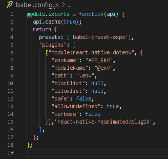

# front

## app

### Instalar

*NPM*

- apt install npm

*YARN*

- npm install --global yarn

*EXPO*

- npm install --global expo-cli

### Instalar Dependencias

*REACT NATIVE* 

- npx expo install react-native-screens react-native-safe-area-context

*ICONOS*

- npm i @expo/vector-icons

*MAPS*

- npx expo install react-native-maps

*LOCALIZACION*

- npx expo install expo-location

*DIRECTIONS*

- npm i react-native-maps-directions

*AUTOCOMPLETE PLACE*

- npm i react-native-google-places-autocomplete

*DOTENV para usar .emv*
- npm i react-native-dotenv, configurar babel config y crear un archivo llamado
.env que tenga la API KEY de Google

*DRAWER,*
- npm i @react-navigation/drawer (y npx expo install react-native-gesture-handler react-native-reanimated ) y configurar index y babel

*REACT SPRING*
- npm install react-spring

*FORM*

- npm install react-native-paper@5.0.0-rc.6

- npm install react-native-paper-form-builder  

*FIREBASE*

- npx expo install firebase

Asi debe quedar babel.config

module.exports = function(api) {
  api.cache(true);
  return {
    presets: ['babel-preset-expo'],
    "plugins": [
      ["module:react-native-dotenv", {
        "envName": "APP_ENV",
        "moduleName": "@env",
        "path": ".env",
        "blocklist": null,
        "allowlist": null,
        "safe": false,
        "allowUndefined": true,
        "verbose": false
      }],'react-native-reanimated/plugin',
    ],
  };
};

Poner esto al ppio de index.js

import 'react-native-gesture-handler';

expo install @react-native-async-storage/async-storage

npx expo install expo-av

### Ejecucion 

En front/app

- yarn add expo

- expo doctor --fix-dependencies

- expo start

Usar emulador de celular o la apliccion de expo para entrar a la app localmente

- Se requiere tener nodejs instalado
